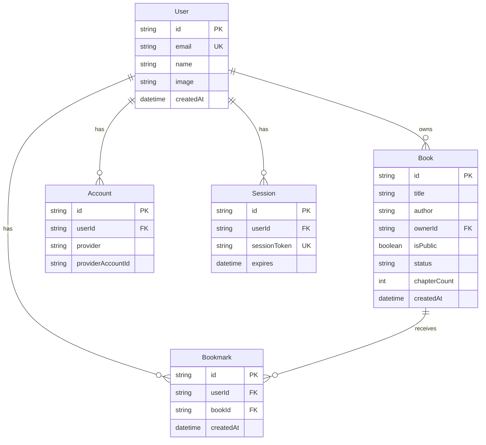

# feat: Google Auth with User Libraries

## Overview

Add Google OAuth authentication to enable personal book libraries with community sharing. Users can upload books as public or private, browse the community library, and bookmark others' public books to their personal library.

**Tech Stack:** NextAuth.js v5 (Auth.js), Prisma ORM, SQLite

**Brainstorm:** `docs/brainstorms/2026-02-05-google-auth-user-libraries-brainstorm.md`

## Problem Statement

The platform currently has no authentication - all books are accessible to everyone and there's no concept of ownership. Users need:

- Personal libraries to organize their uploads
- Privacy controls for sensitive reading material
- A way to save/bookmark interesting books from the community

## Proposed Solution

Implement NextAuth.js v5 with Google OAuth provider, backed by Prisma + SQLite for user/session/ownership data. Keep existing file-based storage for book content (markdown, covers) while adding database layer for user relationships.



## Technical Approach

### Phase 1: Database & Auth Foundation

**Goal:** Set up Prisma with SQLite, configure NextAuth.js v5 with Google OAuth

**Files to create:**

- `prisma/schema.prisma` - Database schema
- `src/lib/prisma.ts` - Prisma client singleton
- `src/auth.ts` - NextAuth.js configuration
- `src/app/api/auth/[...nextauth]/route.ts` - Auth API handler
- `src/types/next-auth.d.ts` - TypeScript type extensions
- `.env.example` - Environment variable template

**Prisma Schema:**

```prisma
generator client {
  provider = "prisma-client-js"
}

datasource db {
  provider = "sqlite"
  url      = env("DATABASE_URL")
}

// NextAuth.js required models
model User {
  id            String    @id @default(cuid())
  name          String?
  email         String?   @unique
  emailVerified DateTime?
  image         String?
  accounts      Account[]
  sessions      Session[]
  books         Book[]
  bookmarks     Bookmark[]
  createdAt     DateTime  @default(now())
  updatedAt     DateTime  @updatedAt
}

model Account {
  id                String  @id @default(cuid())
  userId            String
  type              String
  provider          String
  providerAccountId String
  refresh_token     String?
  access_token      String?
  expires_at        Int?
  token_type        String?
  scope             String?
  id_token          String?
  session_state     String?
  user              User    @relation(fields: [userId], references: [id], onDelete: Cascade)

  @@unique([provider, providerAccountId])
}

model Session {
  id           String   @id @default(cuid())
  sessionToken String   @unique
  userId       String
  expires      DateTime
  user         User     @relation(fields: [userId], references: [id], onDelete: Cascade)
}

model VerificationToken {
  identifier String
  token      String   @unique
  expires    DateTime

  @@unique([identifier, token])
}

// Application models
model Book {
  id           String     @id
  title        String
  author       String
  coverUrl     String?
  chapterCount Int        @default(0)
  status       String     @default("uploading")
  isPublic     Boolean    @default(false)
  ownerId      String
  owner        User       @relation(fields: [ownerId], references: [id], onDelete: Cascade)
  bookmarks    Bookmark[]
  createdAt    DateTime   @default(now())
  processedAt  DateTime?

  @@index([ownerId])
  @@index([isPublic])
}

model Bookmark {
  id        String   @id @default(cuid())
  userId    String
  bookId    String
  user      User     @relation(fields: [userId], references: [id], onDelete: Cascade)
  book      Book     @relation(fields: [bookId], references: [id], onDelete: Cascade)
  createdAt DateTime @default(now())

  @@unique([userId, bookId])
  @@index([userId])
  @@index([bookId])
}
```

**Environment Variables (`.env.example`):**

```bash
# Database
DATABASE_URL="file:./dev.db"

# NextAuth.js
AUTH_SECRET=""  # Generate: openssl rand -base64 32

# Google OAuth
AUTH_GOOGLE_ID=""
AUTH_GOOGLE_SECRET=""
```

**Tasks:**

- [x] Install dependencies: `npm install next-auth@beta @auth/prisma-adapter @prisma/client && npm install -D prisma`
- [x] Initialize Prisma: `npx prisma init --datasource-provider sqlite`
- [x] Create `prisma/schema.prisma` with full schema
- [x] Create `src/lib/prisma.ts` (singleton pattern for Next.js)
- [x] Create `src/auth.ts` (NextAuth config with Google + Prisma adapter)
- [x] Create `src/app/api/auth/[...nextauth]/route.ts`
- [x] Create `src/types/next-auth.d.ts` (extend session with user.id)
- [x] Create `.env.example`
- [x] Run `npx prisma migrate dev --name init`
- [x] Add `prisma/dev.db` to `.gitignore`

### Phase 2: Session Provider & Auth UI

**Goal:** Add SessionProvider to layout, create auth UI components

**Files to create:**

- `src/components/Providers.tsx` - Client-side providers wrapper
- `src/components/AuthButton.tsx` - Sign in/out button
- `src/components/UserMenu.tsx` - Authenticated user dropdown

**Files to modify:**

- `src/app/layout.tsx` - Wrap with Providers

**AuthButton Component:**

```typescript
// src/components/AuthButton.tsx
"use client"

import { useSession, signIn, signOut } from "next-auth/react"

export function AuthButton() {
  const { data: session, status } = useSession()

  if (status === "loading") {
    return <div className="h-10 w-24 animate-pulse bg-stone-200 rounded" />
  }

  if (session) {
    return (
      <button
        onClick={() => signOut()}
        className="flex items-center gap-2 px-4 py-2 text-sm text-stone-600 hover:text-stone-900"
      >
        {session.user?.image && (
          
        )}
        Sign out
      </button>
    )
  }

  return (
    <button
      onClick={() => signIn("google")}
      className="px-4 py-2 text-sm font-medium text-white bg-stone-800 rounded hover:bg-stone-700"
    >
      Sign in with Google
    </button>
  )
}
```

**Tasks:**

- [x] Create `src/components/Providers.tsx` with SessionProvider
- [x] Update `src/app/layout.tsx` to wrap children with Providers
- [x] Create `src/components/AuthButton.tsx`
- [x] Create `src/components/UserMenu.tsx` (avatar, name, sign out)
- [x] Add AuthButton to page header

### Phase 3: Update Book Data Model

**Goal:** Extend Book type with ownership and visibility, update `lib/books.ts`

**Files to modify:**

- `src/types/book.ts` - Add ownerId, isPublic fields
- `src/lib/books.ts` - Integrate Prisma for book metadata

**Updated Book Type:**

```typescript
// src/types/book.ts
export interface Book {
  id: string;
  title: string;
  author: string;
  coverUrl?: string;
  voiceProfile?: VoiceProfile;
  chapterCount: number;
  createdAt: string;
  processedAt?: string;
  status: BookStatus;
  // New fields
  ownerId: string;
  isPublic: boolean;
}
```

**Hybrid Storage Strategy:**

- Book metadata (title, author, ownership, visibility) → SQLite via Prisma
- Book content (chapters.json, \*.md files, cover.jpg) → Filesystem (unchanged)

This preserves the existing Python processing pipeline while adding user relationships.

**Tasks:**

- [x] Update `src/types/book.ts` with ownerId, isPublic
- [x] Update `src/lib/books.ts`:
  - [x] `getBooks()` → Query Prisma, merge with filesystem data
  - [x] `getBook(id)` → Query Prisma for metadata + filesystem for content
  - [x] `createBook()` → Insert into Prisma + create filesystem structure
  - [x] `deleteBook()` → Delete from Prisma + remove filesystem data
- [x] Create migration script for existing books (assigned to craigmd@gmail.com)

### Phase 4: API Route Authorization

**Goal:** Protect API routes with authentication, add ownership checks

**Files to modify:**

- `src/app/api/books/route.ts` - Filter by visibility/ownership
- `src/app/api/books/upload/route.ts` - Require auth, set ownerId
- `src/app/api/books/[id]/route.ts` - Check visibility/ownership for GET, require ownership for DELETE

**Files to create:**

- `src/app/api/books/[id]/visibility/route.ts` - Toggle public/private
- `src/app/api/bookmarks/route.ts` - Create bookmark
- `src/app/api/bookmarks/[id]/route.ts` - Delete bookmark
- `src/app/api/user/library/route.ts` - Get user's library (owned + bookmarked)

**Authorization Matrix:**

| Endpoint                           | Unauth         | Auth (not owner)      | Auth (owner) |
| ---------------------------------- | -------------- | --------------------- | ------------ |
| `GET /api/books`                   | Public only    | Public only           | Public + own |
| `POST /api/books/upload`           | 401            | Create (ownerId=self) | -            |
| `GET /api/books/[id]`              | 404 if private | 404 if private        | Full access  |
| `DELETE /api/books/[id]`           | 401            | 403                   | Delete       |
| `PATCH /api/books/[id]/visibility` | 401            | 403                   | Toggle       |
| `POST /api/bookmarks`              | 401            | Create                | -            |
| `DELETE /api/bookmarks/[id]`       | 401            | Delete own            | -            |

**Tasks:**

- [x] Update `GET /api/books` to filter by `isPublic=true OR ownerId=session.user.id`
- [x] Update `POST /api/books/upload`:
  - [x] Require authentication
  - [x] Get ownerId from session
  - [x] Accept isPublic from request body (default: false)
- [x] Update `GET /api/books/[id]` to check visibility + ownership
- [x] Update `DELETE /api/books/[id]` to verify ownership
- [x] Create `PATCH /api/books/[id]/visibility` for toggle
- [x] Create `POST /api/bookmarks` to create bookmark
- [x] Create `DELETE /api/bookmarks/[id]` to remove bookmark
- [x] Create `GET /api/user/library` to return owned + bookmarked books

### Phase 5: Library UI with Tabs

**Goal:** Add tabbed interface for My Library / Community Library

**Files to create:**

- `src/components/LibraryTabs.tsx` - Tab navigation
- `src/components/BookmarkButton.tsx` - Add/remove bookmark
- `src/components/VisibilityBadge.tsx` - Show public/private status
- `src/components/VisibilityToggle.tsx` - Toggle visibility control

**Files to modify:**

- `src/app/page.tsx` - Add tabs, conditional rendering based on auth

**UI Behavior:**

- Unauthenticated: Show Community Library only (no tabs)
- Authenticated: Show tabs (My Library | Community Library)
- My Library: User's uploaded books + bookmarked books (distinguished visually)
- Community Library: All public books from all users

**Tasks:**

- [x] Create `src/components/LibraryTabs.tsx`
- [x] Create `src/components/BookmarkButton.tsx` (shown on community books)
- [x] Create `src/components/VisibilityBadge.tsx` (public/private indicator)
- [x] Create `src/components/VisibilityToggle.tsx` (for book detail page)
- [x] Update `src/app/page.tsx`:
  - [x] Add LibraryTabs for authenticated users
  - [x] Add state for active tab
  - [x] Fetch appropriate books based on tab
- [x] Update `src/components/BookCard.tsx`:
  - [x] Add BookmarkButton for non-owned books
  - [x] Add VisibilityBadge for owned books
  - [x] Visual distinction for bookmarked vs owned

### Phase 6: Upload Flow Update

**Goal:** Add visibility toggle to upload, handle unauthenticated state

**Files to modify:**

- `src/components/UploadDropzone.tsx` - Add visibility toggle, require auth

**Upload Flow:**

1. Unauthenticated user sees "Sign in to upload your books" message
2. Authenticated user sees dropzone + visibility toggle
3. Default visibility: Private (safer default)
4. On upload: Include `isPublic` in form data, set `ownerId` from session

**Tasks:**

- [x] Update `src/components/UploadDropzone.tsx`:
  - [x] Check session status
  - [x] Show "Sign in to upload" for unauthenticated
  - [x] Add visibility toggle checkbox (default: unchecked = private)
  - [x] Pass isPublic in upload request

## Acceptance Criteria

### Functional Requirements

- [ ] Users can sign in with Google OAuth
- [ ] Users can sign out
- [ ] Unauthenticated users can browse Community Library (public books)
- [ ] Unauthenticated users can read public books
- [ ] Unauthenticated users cannot upload books
- [ ] Authenticated users see two tabs: My Library and Community Library
- [ ] My Library shows user's uploaded books + bookmarked books
- [ ] Users can upload books with public/private visibility setting
- [ ] Users can toggle visibility of their own books
- [ ] Users can bookmark public books from Community Library
- [ ] Users can remove bookmarks
- [ ] Private books are not visible to other users
- [ ] Book deletion cascades to remove associated bookmarks
- [ ] Session persists across page refreshes

### Non-Functional Requirements

- [ ] Auth redirects complete within 3 seconds
- [ ] Database queries use indexes for userId and visibility
- [ ] No sensitive data (tokens, secrets) in client-side code
- [ ] TypeScript strict mode compliance

### Quality Gates

- [x] All existing tests pass
- [ ] New tests for auth utilities
- [ ] New tests for bookmark API
- [x] Lint passes
- [x] TypeCheck passes
- [ ] Manual test: full auth flow with Google

## Success Metrics

- Users can complete sign in → upload → share flow
- No auth-related errors in production
- Private books remain private (verified via direct URL access)

## Dependencies & Prerequisites

**External:**

- Google Cloud Console project with OAuth 2.0 credentials
- Callback URL configured: `http://localhost:3000/api/auth/callback/google`

**Internal:**

- Existing book processing pipeline (Python scripts) - unchanged
- Filesystem storage for book content - unchanged

## Risk Analysis & Mitigation

| Risk                            | Impact           | Mitigation                                                              |
| ------------------------------- | ---------------- | ----------------------------------------------------------------------- |
| OAuth callback misconfiguration | Auth fails       | Document exact Google Console setup                                     |
| Session not persisting          | UX frustration   | Use Prisma adapter for database sessions                                |
| Existing books without owner    | Data orphaned    | Migration script assigns to system user or marks public                 |
| Bookmark cascade on delete      | Data loss        | Cascade delete is intentional; document behavior                        |
| SQLite concurrency limits       | Write contention | Acceptable for single-user/small-scale; migrate to PostgreSQL if needed |

## Open Questions (Resolved)

1. **Book deletion + bookmarks:** Cascade delete bookmarks (simplest, cleanest)
2. **Visibility toggle + bookmarks:** If owner makes book private, bookmarks become inaccessible (book hidden from bookmark holder's library with "unavailable" status)
3. **Default visibility:** Private (safer default)
4. **Existing books:** Make all existing books public with no owner (or assign to first authenticated user)

## References

### Internal

- Brainstorm: `docs/brainstorms/2026-02-05-google-auth-user-libraries-brainstorm.md`
- Current book types: `src/types/book.ts`
- Current API routes: `src/app/api/books/`

### External

- [Auth.js v5 Documentation](https://authjs.dev/)
- [Auth.js Prisma Adapter](https://authjs.dev/getting-started/adapters/prisma)
- [Prisma SQLite Guide](https://www.prisma.io/docs/getting-started/prisma-orm/quickstart/sqlite)
- [NextAuth TypeScript](https://authjs.dev/getting-started/typescript)

## Implementation Order

```
Phase 1: Database & Auth Foundation
    │
    ├── Install dependencies
    ├── Prisma schema + migrate
    ├── NextAuth config
    └── Type definitions
          │
          v
Phase 2: Session Provider & Auth UI
    │
    ├── Providers wrapper
    ├── AuthButton component
    └── Add to layout
          │
          v
Phase 3: Update Book Data Model
    │
    ├── Extend Book type
    ├── Update lib/books.ts
    └── Migration script
          │
          v
Phase 4: API Route Authorization
    │
    ├── Protect existing routes
    ├── Add visibility endpoint
    └── Add bookmark endpoints
          │
          v
Phase 5: Library UI with Tabs
    │
    ├── LibraryTabs component
    ├── BookmarkButton
    ├── VisibilityBadge/Toggle
    └── Update page.tsx
          │
          v
Phase 6: Upload Flow Update
    │
    ├── Auth check in dropzone
    └── Visibility toggle
          │
          v
    Quality Gates (lint, test, typecheck)
```
