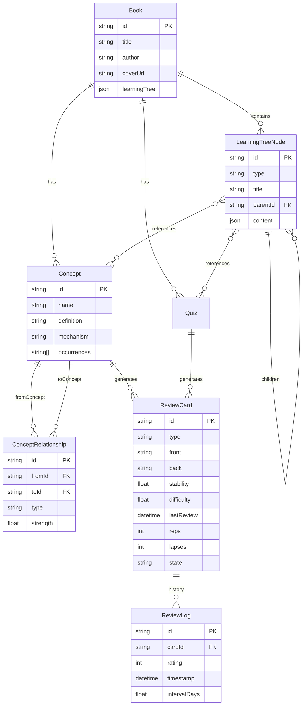

# BookSite Learning Platform Overhaul

## Overview

Transform the current book visualization app into a world-class interactive learning platform that leverages AI to create deep, tree-structured exploration of book content with spaced repetition, active recall, and a conversational AI tutor powered by the Claude Agent SDK.

**Current State**: A functional but "hokey" EPUB-to-web pipeline with 7 learning modes (Quiz, Concepts, Feynman, Schemas, Projects, Images, Overview) and basic chapter navigation. The UI is polished but the experience feels disconnected - modes don't flow into each other, depth exploration is flat, and the AI chat is basic request-response.

**Target State**: An immersive "learning tree" where users can:
1. Start at a high-level summary and drill down progressively (Summary → Key Points → Deep Dive → Application)
2. Ask questions and have Claude navigate the book in real-time, updating the UI dynamically
3. Get personalized review schedules with spaced repetition across all content types
4. Visualize concept relationships as an interactive knowledge graph
5. Switch seamlessly between "understand", "apply", and "recall" modes

---

## Problem Statement

### What's Not Working

1. **Flat Navigation**: Chapters are linear; no sense of depth or tree structure. Users can't "zoom in" on a concept and then "zoom out" to see context.

2. **Disconnected Modes**: Quiz, Concepts, Feynman, etc. feel like separate apps. There's no flow like "I don't understand this quiz question → explain it → show me an example → quiz me again."

3. **Basic AI Chat**: Current `/api/chat/route.ts` is request-response with ~10 concepts hardcoded. No streaming, no tool use, no dynamic UI updates.

4. **No Orchestration**: The 3-layer architecture (Directives → Orchestration → Execution) exists in theory but `process_book.py` does everything sequentially without intelligent routing.

5. **Unused Data**: Audio scripts, video scripts, priming, inquiry, and flight plan JSON files are generated but never displayed.

6. **Brittle Chapter Matching**: String normalization for filtering is fragile. Should use stable IDs.

7. **localStorage Only**: Quiz progress/spaced repetition data lives only in browser. No persistence, no sync.

---

## Proposed Solution

### Core Concept: The Learning Tree

Instead of flat chapter navigation, implement a **Learning Tree** interface where:

```
Book
├── Theme 1: "Building Habits"
│   ├── Summary (30 sec read)
│   ├── Key Concepts (2-3 min)
│   │   ├── Cue-Routine-Reward Loop
│   │   │   ├── Definition
│   │   │   ├── Simple Analogy (Feynman)
│   │   │   ├── Deep Dive (mechanism)
│   │   │   ├── Examples from Book
│   │   │   ├── Real-World Applications
│   │   │   └── Practice Quiz (3 questions)
│   │   └── Habit Stacking
│   │       └── ... (same depth levels)
│   └── Chapter Content (full text)
└── Theme 2: "Breaking Bad Habits"
    └── ...
```

**Key Innovation**: Each node can be expanded/collapsed. Clicking a concept opens a side panel with depth levels. The AI can navigate this tree and suggest paths.

---

## Technical Approach

### Phase 1: Foundation Cleanup (Week 1)

#### 1.1 Stabilize Data Model

**Files to modify:**
- `src/app/book/[id]/page.tsx`
- `src/components/LearningInterface.tsx`
- `execution/convert_epub_to_markdown.py`

**Changes:**
- Generate stable UUIDs for chapters in `convert_epub_to_markdown.py`
- Create a unified `BookData` TypeScript interface
- Consolidate `chapters.json`, `content.json`, and chapter files into single source of truth

**Data Schema:**

```typescript
// src/types/book.ts
interface BookData {
  id: string;
  title: string;
  author: string;
  coverUrl: string;

  structure: ThemeNode[];
  concepts: ConceptNode[];
  relationships: ConceptRelationship[];

  quizzes: Quiz[];
  schemas: Schema[];
  projects: Project[];

  // New: hierarchical learning tree
  learningTree: LearningTreeNode;
}

interface LearningTreeNode {
  id: string;
  type: 'theme' | 'chapter' | 'concept' | 'depth-level';
  title: string;
  children: LearningTreeNode[];
  content?: {
    summary?: string;      // Level 1: 30 sec
    keyPoints?: string[];  // Level 2: 2-3 min
    deepDive?: string;     // Level 3: 10-15 min
    application?: string;  // Level 4: practical
  };
  relatedQuizIds?: string[];
  relatedConceptIds?: string[];
}

interface ConceptRelationship {
  fromId: string;
  toId: string;
  type: 'requires' | 'extends' | 'contrasts' | 'applies-to';
  strength: number; // 0-1
}
```

#### 1.2 Upgrade Chat API to Streaming

**Files to create/modify:**
- `src/app/api/chat/route.ts` (major rewrite)
- `src/lib/bookContext.ts` (new)
- `src/components/AIChat.tsx` (upgrade to streaming)

**Implementation:**

```typescript
// src/app/api/chat/route.ts
import { streamText, convertToModelMessages, UIMessage } from 'ai';
import { anthropic } from '@ai-sdk/anthropic';
import { getBookContext, getConceptDetails, searchBookContent } from '@/lib/bookContext';

export const maxDuration = 60;

const tools = {
  getConceptDetails: {
    description: 'Get detailed information about a specific concept from the book',
    parameters: z.object({
      conceptName: z.string(),
      depthLevel: z.enum(['summary', 'keyPoints', 'deepDive', 'application']).optional()
    }),
    execute: async ({ conceptName, depthLevel }) => {
      return await getConceptDetails(bookId, conceptName, depthLevel);
    }
  },
  searchBookContent: {
    description: 'Search for content in the book by keyword or theme',
    parameters: z.object({
      query: z.string(),
      chapterFilter: z.string().optional()
    }),
    execute: async ({ query, chapterFilter }) => {
      return await searchBookContent(bookId, query, chapterFilter);
    }
  },
  navigateToSection: {
    description: 'Navigate the UI to a specific section of the book',
    parameters: z.object({
      sectionId: z.string(),
      highlightText: z.string().optional()
    }),
    execute: async ({ sectionId, highlightText }) => {
      // Returns navigation instruction for client
      return { action: 'navigate', sectionId, highlightText };
    }
  },
  generateQuiz: {
    description: 'Generate a quick quiz on a specific topic',
    parameters: z.object({
      topic: z.string(),
      difficulty: z.enum(['easy', 'medium', 'hard']),
      questionCount: z.number().max(5)
    }),
    execute: async ({ topic, difficulty, questionCount }) => {
      return await generateQuiz(bookId, topic, difficulty, questionCount);
    }
  }
};

export async function POST(req: Request) {
  const { messages, bookId, currentSection }: {
    messages: UIMessage[];
    bookId: string;
    currentSection?: string;
  } = await req.json();

  const bookContext = await getBookContext(bookId, currentSection);

  const result = streamText({
    model: anthropic('claude-sonnet-4-20250514'),
    system: `You are an expert learning assistant for "${bookContext.title}" by ${bookContext.author}.

Your capabilities:
1. Answer questions about the book using Socratic questioning when helpful
2. Navigate users through content at different depth levels
3. Generate practice quizzes on demand
4. Explain concepts using the Feynman technique (simple analogies)
5. Connect ideas across chapters

Current context:
- User is viewing: ${currentSection || 'Book overview'}
- Book thesis: ${bookContext.thesis}
- Key themes: ${bookContext.themes.join(', ')}

Guidelines:
- Use tools to access specific book content rather than guessing
- When explaining, start simple and offer to go deeper
- If the user seems confused, offer a simpler explanation
- Suggest related concepts they might want to explore
- Use markdown for formatting`,
    messages: convertToModelMessages(messages),
    tools,
    maxSteps: 5, // Allow multi-step tool use
  });

  return result.toUIMessageStreamResponse();
}
```

### Phase 2: Learning Tree UI (Week 2)

#### 2.1 Tree Navigation Component

**Files to create:**
- `src/components/LearningTree.tsx`
- `src/components/TreeNode.tsx`
- `src/components/DepthPanel.tsx`

**Visual Design:**

```
┌─────────────────────────────────────────────────────────────────┐
│ ◄ Back to Library          Atomic Habits          🔍 Search    │
├─────────────────────────────────────────────────────────────────┤
│                                                                 │
│  LEARNING TREE              │  CONTENT PANEL                   │
│  ────────────────           │  ───────────────                 │
│                             │                                   │
│  ▼ Building Better Habits   │  ┌─────────────────────────────┐ │
│    ├─ Cue-Routine-Reward   │  │ Habit Stacking              │ │
│    │   └─ [4 depth levels] │  │                             │ │
│    ├─ ● Habit Stacking ←── │  │ DEPTH: ○○●○                 │ │
│    │   └─ [4 depth levels] │  │ [Summary] [Key] [Deep] [App]│ │
│    └─ Environment Design   │  │                             │ │
│                             │  │ "Habit stacking is linking │ │
│  ▶ Breaking Bad Habits      │  │  a new habit to an existing│ │
│  ▶ Identity-Based Change    │  │  one..."                   │ │
│  ▶ The 4 Laws               │  │                             │ │
│                             │  │ ─────────────────────────── │ │
│                             │  │ RELATED CONCEPTS:           │ │
│  ─────────────────          │  │ • Implementation Intentions │ │
│  PROGRESS: 34% complete     │  │ • Temptation Bundling      │ │
│  📅 3 items due for review  │  │                             │ │
│                             │  │ [Quiz Me] [Explain Simpler] │ │
│                             │  └─────────────────────────────┘ │
│                             │                                   │
├─────────────────────────────────────────────────────────────────┤
│  💬 Ask a question...                            [AI Assistant] │
└─────────────────────────────────────────────────────────────────┘
```

**Component Structure:**

```typescript
// src/components/LearningTree.tsx
'use client';

import { useState } from 'react';
import { TreeNode } from './TreeNode';
import { DepthPanel } from './DepthPanel';
import { useBookData } from '@/hooks/useBookData';

interface LearningTreeProps {
  bookId: string;
  onNodeSelect: (nodeId: string) => void;
  onDepthChange: (nodeId: string, depth: number) => void;
}

export function LearningTree({ bookId, onNodeSelect, onDepthChange }: LearningTreeProps) {
  const { data: book, isLoading } = useBookData(bookId);
  const [selectedNode, setSelectedNode] = useState<string | null>(null);
  const [expandedNodes, setExpandedNodes] = useState<Set<string>>(new Set());
  const [currentDepth, setCurrentDepth] = useState(1);

  const handleNodeClick = (nodeId: string) => {
    setSelectedNode(nodeId);
    onNodeSelect(nodeId);
  };

  const handleDepthChange = (depth: number) => {
    setCurrentDepth(depth);
    if (selectedNode) {
      onDepthChange(selectedNode, depth);
    }
  };

  const toggleExpand = (nodeId: string) => {
    setExpandedNodes(prev => {
      const next = new Set(prev);
      if (next.has(nodeId)) {
        next.delete(nodeId);
      } else {
        next.add(nodeId);
      }
      return next;
    });
  };

  if (isLoading) return <TreeSkeleton />;

  return (
    <div className="flex h-full">
      {/* Tree Panel */}
      <div className="w-72 border-r border-white/10 overflow-y-auto">
        <div className="p-4">
          <h2 className="text-lg font-semibold mb-4">Learning Tree</h2>
          {book.learningTree.children.map(node => (
            <TreeNode
              key={node.id}
              node={node}
              depth={0}
              isSelected={selectedNode === node.id}
              isExpanded={expandedNodes.has(node.id)}
              onSelect={handleNodeClick}
              onToggle={toggleExpand}
            />
          ))}
        </div>

        {/* Progress Summary */}
        <div className="p-4 border-t border-white/10">
          <ProgressSummary bookId={bookId} />
        </div>
      </div>

      {/* Content Panel */}
      <div className="flex-1 overflow-y-auto">
        {selectedNode ? (
          <DepthPanel
            nodeId={selectedNode}
            currentDepth={currentDepth}
            onDepthChange={handleDepthChange}
            onAskAI={(question) => {/* Trigger AI chat */}}
          />
        ) : (
          <BookOverview book={book} />
        )}
      </div>
    </div>
  );
}
```

#### 2.2 Depth Panel with Progressive Disclosure

**File: `src/components/DepthPanel.tsx`**

```typescript
'use client';

import { useState } from 'react';
import { motion, AnimatePresence } from 'framer-motion';
import { useNodeContent } from '@/hooks/useNodeContent';

const DEPTH_LEVELS = [
  { id: 1, label: 'Summary', icon: '📋', readTime: '30 sec' },
  { id: 2, label: 'Key Points', icon: '🔑', readTime: '2-3 min' },
  { id: 3, label: 'Deep Dive', icon: '🔬', readTime: '10-15 min' },
  { id: 4, label: 'Application', icon: '🎯', readTime: 'Practice' },
];

interface DepthPanelProps {
  nodeId: string;
  currentDepth: number;
  onDepthChange: (depth: number) => void;
  onAskAI: (question: string) => void;
}

export function DepthPanel({ nodeId, currentDepth, onDepthChange, onAskAI }: DepthPanelProps) {
  const { content, relatedConcepts, quizzes, isLoading } = useNodeContent(nodeId);
  const [showQuiz, setShowQuiz] = useState(false);

  return (
    <div className="p-6 max-w-3xl mx-auto">
      {/* Header with title */}
      <header className="mb-6">
        <h1 className="text-2xl font-bold">{content.title}</h1>
        <p className="text-snow-dim mt-1">
          From: {content.sourceChapter}
        </p>
      </header>

      {/* Depth Selector */}
      <div className="flex gap-2 mb-6 p-1 bg-void-light rounded-xl">
        {DEPTH_LEVELS.map((level) => (
          <button
            key={level.id}
            onClick={() => onDepthChange(level.id)}
            className={`
              flex-1 py-2 px-3 rounded-lg transition-all
              ${currentDepth === level.id
                ? 'bg-electric-blue text-white'
                : 'hover:bg-void-lighter text-snow-dim'}
            `}
          >
            <span className="text-lg">{level.icon}</span>
            <span className="ml-2 text-sm">{level.label}</span>
          </button>
        ))}
      </div>

      {/* Content Area with Animation */}
      <AnimatePresence mode="wait">
        <motion.div
          key={currentDepth}
          initial={{ opacity: 0, y: 10 }}
          animate={{ opacity: 1, y: 0 }}
          exit={{ opacity: 0, y: -10 }}
          transition={{ duration: 0.2 }}
          className="prose prose-invert max-w-none"
        >
          {currentDepth === 1 && <SummaryContent content={content.summary} />}
          {currentDepth === 2 && <KeyPointsContent points={content.keyPoints} />}
          {currentDepth === 3 && <DeepDiveContent content={content.deepDive} />}
          {currentDepth === 4 && (
            <ApplicationContent
              content={content.application}
              quizzes={quizzes}
              showQuiz={showQuiz}
              onToggleQuiz={() => setShowQuiz(!showQuiz)}
            />
          )}
        </motion.div>
      </AnimatePresence>

      {/* Related Concepts */}
      {relatedConcepts.length > 0 && (
        <section className="mt-8 pt-6 border-t border-white/10">
          <h3 className="text-sm font-semibold text-snow-dim mb-3">
            Related Concepts
          </h3>
          <div className="flex flex-wrap gap-2">
            {relatedConcepts.map(concept => (
              <button
                key={concept.id}
                onClick={() => {/* Navigate to concept */}}
                className="px-3 py-1.5 bg-void-lighter rounded-full text-sm hover:bg-electric-purple/20 transition"
              >
                {concept.name}
              </button>
            ))}
          </div>
        </section>
      )}

      {/* Quick Actions */}
      <div className="mt-8 flex gap-3">
        <button
          onClick={() => onAskAI(`Explain "${content.title}" in simpler terms`)}
          className="btn-secondary"
        >
          🤔 Explain Simpler
        </button>
        <button
          onClick={() => setShowQuiz(true)}
          className="btn-secondary"
        >
          📝 Quiz Me
        </button>
        <button
          onClick={() => onAskAI(`What are real-world applications of "${content.title}"?`)}
          className="btn-secondary"
        >
          🌍 Real Examples
        </button>
      </div>
    </div>
  );
}
```

### Phase 3: Knowledge Graph Visualization (Week 3)

#### 3.1 Interactive Concept Map

**Files to create:**
- `src/components/KnowledgeGraph.tsx`
- `src/hooks/useGraphData.ts`

**Using D3.js or React Flow:**

```typescript
// src/components/KnowledgeGraph.tsx
'use client';

import { useCallback, useMemo } from 'react';
import ReactFlow, {
  Node,
  Edge,
  Controls,
  Background,
  useNodesState,
  useEdgesState,
  ConnectionMode,
} from 'reactflow';
import 'reactflow/dist/style.css';
import { ConceptNode } from './ConceptNode';
import { useGraphData } from '@/hooks/useGraphData';

const nodeTypes = {
  concept: ConceptNode,
};

interface KnowledgeGraphProps {
  bookId: string;
  focusConceptId?: string;
  onConceptSelect: (conceptId: string) => void;
}

export function KnowledgeGraph({ bookId, focusConceptId, onConceptSelect }: KnowledgeGraphProps) {
  const { concepts, relationships } = useGraphData(bookId);

  const nodes: Node[] = useMemo(() =>
    concepts.map((concept, index) => ({
      id: concept.id,
      type: 'concept',
      position: calculatePosition(index, concepts.length),
      data: {
        label: concept.name,
        mastery: concept.masteryLevel,
        chapter: concept.sourceChapter,
        isFocused: concept.id === focusConceptId,
      },
    })),
    [concepts, focusConceptId]
  );

  const edges: Edge[] = useMemo(() =>
    relationships.map((rel) => ({
      id: `${rel.fromId}-${rel.toId}`,
      source: rel.fromId,
      target: rel.toId,
      type: 'smoothstep',
      animated: rel.type === 'requires',
      style: {
        stroke: getEdgeColor(rel.type),
        strokeWidth: rel.strength * 3,
      },
      label: rel.type,
    })),
    [relationships]
  );

  const [nodesState, setNodes, onNodesChange] = useNodesState(nodes);
  const [edgesState, setEdges, onEdgesChange] = useEdgesState(edges);

  const onNodeClick = useCallback((event: React.MouseEvent, node: Node) => {
    onConceptSelect(node.id);
  }, [onConceptSelect]);

  return (
    <div className="h-full w-full">
      <ReactFlow
        nodes={nodesState}
        edges={edgesState}
        onNodesChange={onNodesChange}
        onEdgesChange={onEdgesChange}
        onNodeClick={onNodeClick}
        nodeTypes={nodeTypes}
        connectionMode={ConnectionMode.Loose}
        fitView
      >
        <Background color="#1a1a2e" gap={16} />
        <Controls />
      </ReactFlow>

      {/* Legend */}
      <div className="absolute bottom-4 left-4 p-3 bg-void/90 rounded-lg">
        <h4 className="text-xs font-semibold mb-2">Relationship Types</h4>
        <div className="space-y-1 text-xs">
          <div className="flex items-center gap-2">
            <div className="w-4 h-0.5 bg-electric-blue" /> Requires
          </div>
          <div className="flex items-center gap-2">
            <div className="w-4 h-0.5 bg-electric-purple" /> Extends
          </div>
          <div className="flex items-center gap-2">
            <div className="w-4 h-0.5 bg-electric-amber" /> Applies To
          </div>
        </div>
      </div>
    </div>
  );
}

function getEdgeColor(type: string): string {
  switch (type) {
    case 'requires': return '#3b82f6';
    case 'extends': return '#8b5cf6';
    case 'contrasts': return '#f43f5e';
    case 'applies-to': return '#f59e0b';
    default: return '#6b7280';
  }
}

function calculatePosition(index: number, total: number) {
  // Circular layout
  const radius = 300;
  const angle = (2 * Math.PI * index) / total;
  return {
    x: radius * Math.cos(angle) + 400,
    y: radius * Math.sin(angle) + 300,
  };
}
```

### Phase 4: Enhanced Spaced Repetition (Week 4)

#### 4.1 FSRS Algorithm Implementation

**Files to create:**
- `src/lib/fsrs.ts`
- `src/hooks/useSpacedRepetition.ts`
- `src/components/ReviewSchedule.tsx`

**FSRS Implementation (more effective than SM-2):**

```typescript
// src/lib/fsrs.ts
// Free Spaced Repetition Scheduler - research-backed algorithm

interface Card {
  id: string;
  stability: number;     // Memory stability
  difficulty: number;    // Item difficulty (0-1)
  lastReview: Date;
  reps: number;
  lapses: number;
  state: 'new' | 'learning' | 'review' | 'relearning';
}

interface ReviewResult {
  card: Card;
  nextReview: Date;
  interval: number;
}

const FSRS_PARAMS = {
  w: [0.4, 0.6, 2.4, 5.8, 4.93, 0.94, 0.86, 0.01, 1.49, 0.14, 0.94, 2.18, 0.05, 0.34, 1.26, 0.29, 2.61],
  requestRetention: 0.9,
  maximumInterval: 36500,
  easyBonus: 1.3,
  hardInterval: 1.2,
};

export function calculateNextReview(card: Card, rating: 1 | 2 | 3 | 4): ReviewResult {
  // Rating: 1=Again, 2=Hard, 3=Good, 4=Easy

  const now = new Date();
  let newStability: number;
  let newDifficulty: number;
  let interval: number;

  if (card.state === 'new') {
    // Initial stability based on rating
    newStability = FSRS_PARAMS.w[rating - 1];
    newDifficulty = FSRS_PARAMS.w[4] - (rating - 3) * FSRS_PARAMS.w[5];
    newDifficulty = Math.max(0.1, Math.min(1, newDifficulty));
  } else {
    // Calculate retrievability
    const elapsedDays = (now.getTime() - card.lastReview.getTime()) / (1000 * 60 * 60 * 24);
    const retrievability = Math.exp(-elapsedDays / card.stability);

    // Update difficulty
    newDifficulty = card.difficulty + FSRS_PARAMS.w[6] * (rating - 3);
    newDifficulty = Math.max(0.1, Math.min(1, newDifficulty));

    // Update stability
    if (rating === 1) {
      // Lapse - reset stability
      newStability = FSRS_PARAMS.w[11] *
        Math.pow(card.difficulty, -FSRS_PARAMS.w[12]) *
        (Math.pow(card.stability + 1, FSRS_PARAMS.w[13]) - 1) *
        Math.exp((1 - retrievability) * FSRS_PARAMS.w[14]);
    } else {
      // Success - increase stability
      newStability = card.stability * (
        1 +
        Math.exp(FSRS_PARAMS.w[8]) *
        (11 - newDifficulty) *
        Math.pow(card.stability, -FSRS_PARAMS.w[9]) *
        (Math.exp((1 - retrievability) * FSRS_PARAMS.w[10]) - 1) *
        (rating === 2 ? FSRS_PARAMS.hardInterval : 1) *
        (rating === 4 ? FSRS_PARAMS.easyBonus : 1)
      );
    }
  }

  // Calculate interval from stability
  interval = Math.round(
    newStability *
    Math.log(FSRS_PARAMS.requestRetention) /
    Math.log(0.9)
  );
  interval = Math.max(1, Math.min(interval, FSRS_PARAMS.maximumInterval));

  const nextReview = new Date(now.getTime() + interval * 24 * 60 * 60 * 1000);

  return {
    card: {
      ...card,
      stability: newStability,
      difficulty: newDifficulty,
      lastReview: now,
      reps: card.reps + 1,
      lapses: rating === 1 ? card.lapses + 1 : card.lapses,
      state: rating === 1 ? 'relearning' : 'review',
    },
    nextReview,
    interval,
  };
}

export function getDueCards(cards: Card[]): Card[] {
  const now = new Date();
  return cards
    .filter(card => {
      if (card.state === 'new') return true;
      const nextReview = new Date(card.lastReview.getTime() +
        calculateNextReview(card, 3).interval * 24 * 60 * 60 * 1000);
      return nextReview <= now;
    })
    .sort((a, b) => {
      // Prioritize: overdue > relearning > learning > new
      const priority = { relearning: 0, learning: 1, review: 2, new: 3 };
      return priority[a.state] - priority[b.state];
    });
}
```

#### 4.2 Review Dashboard Component

**File: `src/components/ReviewDashboard.tsx`**

```typescript
'use client';

import { useState } from 'react';
import { useSpacedRepetition } from '@/hooks/useSpacedRepetition';
import { Card, calculateNextReview } from '@/lib/fsrs';

interface ReviewDashboardProps {
  bookId: string;
}

export function ReviewDashboard({ bookId }: ReviewDashboardProps) {
  const { dueCards, reviewCard, stats } = useSpacedRepetition(bookId);
  const [currentCard, setCurrentCard] = useState<Card | null>(null);
  const [showAnswer, setShowAnswer] = useState(false);

  const handleRating = async (rating: 1 | 2 | 3 | 4) => {
    if (!currentCard) return;

    const result = calculateNextReview(currentCard, rating);
    await reviewCard(result.card);

    setShowAnswer(false);
    // Get next card
    const nextCard = dueCards[0];
    setCurrentCard(nextCard || null);
  };

  return (
    <div className="max-w-2xl mx-auto p-6">
      {/* Stats Header */}
      <div className="grid grid-cols-4 gap-4 mb-8">
        <StatCard label="Due Today" value={stats.dueToday} color="blue" />
        <StatCard label="New" value={stats.newCards} color="cyan" />
        <StatCard label="Learning" value={stats.learning} color="amber" />
        <StatCard label="Mastered" value={stats.mastered} color="emerald" />
      </div>

      {/* Review Card */}
      {currentCard ? (
        <div className="bg-void-light rounded-2xl p-8">
          {/* Question */}
          <div className="mb-8">
            <p className="text-sm text-snow-dim mb-2">
              {currentCard.type === 'concept' ? 'Define this concept:' : 'Answer:'}
            </p>
            <h2 className="text-2xl font-semibold">{currentCard.front}</h2>
          </div>

          {/* Answer (revealed on click) */}
          {showAnswer ? (
            <>
              <div className="border-t border-white/10 pt-6 mb-8">
                <p className="text-snow">{currentCard.back}</p>
              </div>

              {/* Rating Buttons */}
              <div className="grid grid-cols-4 gap-3">
                <RatingButton
                  rating={1}
                  label="Again"
                  sublabel="< 1min"
                  color="rose"
                  onClick={() => handleRating(1)}
                />
                <RatingButton
                  rating={2}
                  label="Hard"
                  sublabel={formatInterval(currentCard, 2)}
                  color="amber"
                  onClick={() => handleRating(2)}
                />
                <RatingButton
                  rating={3}
                  label="Good"
                  sublabel={formatInterval(currentCard, 3)}
                  color="emerald"
                  onClick={() => handleRating(3)}
                />
                <RatingButton
                  rating={4}
                  label="Easy"
                  sublabel={formatInterval(currentCard, 4)}
                  color="blue"
                  onClick={() => handleRating(4)}
                />
              </div>
            </>
          ) : (
            <button
              onClick={() => setShowAnswer(true)}
              className="w-full py-4 bg-electric-blue rounded-xl font-semibold hover:bg-electric-blue/90 transition"
            >
              Show Answer
            </button>
          )}
        </div>
      ) : (
        <EmptyState message="No cards due for review! Great job!" />
      )}

      {/* Upcoming Reviews */}
      <section className="mt-8">
        <h3 className="text-lg font-semibold mb-4">Upcoming Reviews</h3>
        <ReviewCalendar bookId={bookId} />
      </section>
    </div>
  );
}
```

### Phase 5: AI-Powered Dynamic UI Updates (Week 5)

#### 5.1 Real-Time UI Synchronization

The AI chat should be able to trigger UI updates. Implement a message bus:

**File: `src/lib/uiActions.ts`**

```typescript
// Actions the AI can trigger
export type UIAction =
  | { type: 'navigate'; sectionId: string; highlightText?: string }
  | { type: 'openDepthLevel'; nodeId: string; depth: number }
  | { type: 'showQuiz'; conceptId: string }
  | { type: 'highlightConcept'; conceptId: string }
  | { type: 'showRelated'; conceptId: string }
  | { type: 'expandTreeNode'; nodeId: string };

// Event bus for UI actions
class UIActionBus {
  private listeners: ((action: UIAction) => void)[] = [];

  subscribe(listener: (action: UIAction) => void) {
    this.listeners.push(listener);
    return () => {
      this.listeners = this.listeners.filter(l => l !== listener);
    };
  }

  dispatch(action: UIAction) {
    this.listeners.forEach(l => l(action));
  }
}

export const uiActionBus = new UIActionBus();
```

**Integration in Chat Component:**

```typescript
// In AIChat.tsx, handle tool results that contain UI actions
const handleToolResult = (toolName: string, result: any) => {
  if (result.action) {
    uiActionBus.dispatch(result);
  }
};
```

**Consuming in Main Page:**

```typescript
// In book/[id]/page.tsx
import { useEffect } from 'react';
import { uiActionBus, UIAction } from '@/lib/uiActions';

export default function BookPage({ params }: { params: { id: string } }) {
  const [selectedNode, setSelectedNode] = useState<string | null>(null);
  const [currentDepth, setCurrentDepth] = useState(1);

  useEffect(() => {
    const unsubscribe = uiActionBus.subscribe((action: UIAction) => {
      switch (action.type) {
        case 'navigate':
          setSelectedNode(action.sectionId);
          // Scroll into view, highlight if specified
          break;
        case 'openDepthLevel':
          setSelectedNode(action.nodeId);
          setCurrentDepth(action.depth);
          break;
        case 'showQuiz':
          // Open quiz modal for concept
          break;
        // ... handle other actions
      }
    });

    return unsubscribe;
  }, []);

  // ... rest of component
}
```

### Phase 6: Data Pipeline Improvements (Week 6)

#### 6.1 Generate Learning Tree from Existing Data

**File: `execution/generate_learning_tree.py`**

```python
"""
Generate hierarchical learning tree from processed book data.
Consolidates chapters, concepts, Feynman explanations into tree structure.
"""

import json
import os
from pathlib import Path
import google.generativeai as genai
from typing import TypedDict, List

class LearningTreeNode(TypedDict):
    id: str
    type: str  # 'theme' | 'chapter' | 'concept' | 'depth-level'
    title: str
    children: List['LearningTreeNode']
    content: dict  # summary, keyPoints, deepDive, application

def generate_learning_tree(book_id: str) -> dict:
    """Transform flat book data into hierarchical learning tree."""

    data_dir = Path(f"data/books/{book_id}")

    # Load existing data
    with open(data_dir / "content.json") as f:
        chapters = json.load(f)
    with open(data_dir / "master_concepts.json") as f:
        concepts = json.load(f)
    with open(data_dir / "feynman.json") as f:
        feynman = json.load(f)
    with open(data_dir / "feynman_book.json") as f:
        book_feynman = json.load(f)

    # Use Gemini to cluster chapters into themes
    model = genai.GenerativeModel("gemini-2.0-flash-exp")

    theme_prompt = f"""
    Analyze these chapter titles and summaries from a book.
    Group them into 3-6 major themes/parts.

    Chapters:
    {json.dumps([{"title": c["title"], "summary": c.get("summary", "")} for c in chapters], indent=2)}

    Return JSON:
    {{
      "themes": [
        {{
          "id": "theme-1",
          "title": "Theme Name",
          "description": "Brief description",
          "chapterIds": ["chapter-1", "chapter-2"]
        }}
      ]
    }}
    """

    theme_response = model.generate_content(theme_prompt)
    themes = json.loads(theme_response.text)["themes"]

    # Build tree structure
    tree = {
        "id": "root",
        "type": "book",
        "title": book_feynman.get("title", "Book"),
        "children": [],
        "content": {
            "summary": book_feynman.get("thesis", ""),
            "keyPoints": [book_feynman.get("analogy", ""), book_feynman.get("eli12", "")],
        }
    }

    for theme in themes:
        theme_node = {
            "id": theme["id"],
            "type": "theme",
            "title": theme["title"],
            "children": [],
            "content": {
                "summary": theme["description"]
            }
        }

        # Add chapters under theme
        for chapter_id in theme["chapterIds"]:
            chapter = next((c for c in chapters if c["id"] == chapter_id), None)
            if not chapter:
                continue

            chapter_node = {
                "id": chapter["id"],
                "type": "chapter",
                "title": chapter["title"],
                "children": [],
                "content": {
                    "summary": chapter.get("summary", ""),
                    "keyPoints": extract_key_points(chapter),
                    "deepDive": chapter.get("content", ""),
                }
            }

            # Add concepts under chapter
            chapter_concepts = [c for c in concepts if chapter["title"].lower() in
                             [occ.lower() for occ in c.get("occurrences", [])]]

            for concept in chapter_concepts:
                concept_feynman = next(
                    (f for f in feynman if f.get("source_chapter") == chapter["id"]),
                    None
                )

                concept_node = {
                    "id": f"concept-{concept['name'].lower().replace(' ', '-')}",
                    "type": "concept",
                    "title": concept["name"],
                    "children": [],
                    "content": {
                        "summary": concept.get("definition", ""),
                        "keyPoints": [concept.get("mechanism", "")],
                        "deepDive": concept.get("context", ""),
                        "application": concept_feynman.get("why_it_matters", "") if concept_feynman else "",
                    }
                }
                chapter_node["children"].append(concept_node)

            theme_node["children"].append(chapter_node)

        tree["children"].append(theme_node)

    # Save tree
    with open(data_dir / "learning_tree.json", "w") as f:
        json.dump(tree, f, indent=2)

    return tree

def extract_key_points(chapter: dict) -> List[str]:
    """Extract 3-5 key points from chapter content."""
    # Use stories as key points if available
    stories = chapter.get("stories", [])
    if stories:
        return [s.get("lesson", s.get("description", "")) for s in stories[:5]]
    return []

if __name__ == "__main__":
    import sys
    book_id = sys.argv[1] if len(sys.argv) > 1 else "atomic-habits"
    tree = generate_learning_tree(book_id)
    print(f"Generated learning tree with {len(tree['children'])} themes")
```

#### 6.2 Generate Concept Relationships

**File: `execution/generate_relationships.py`**

```python
"""
Generate concept relationship graph for knowledge visualization.
"""

import json
from pathlib import Path
import google.generativeai as genai

def generate_relationships(book_id: str) -> list:
    """Analyze concepts and generate relationship edges."""

    data_dir = Path(f"data/books/{book_id}")

    with open(data_dir / "master_concepts.json") as f:
        concepts = json.load(f)

    model = genai.GenerativeModel("gemini-2.0-flash-exp")

    # Process in batches to avoid token limits
    concept_names = [c["name"] for c in concepts]
    relationships = []

    for i, concept in enumerate(concepts):
        # Find relationships for this concept
        prompt = f"""
        Analyze this concept from a book and find its relationships to other concepts.

        Main concept: {concept["name"]}
        Definition: {concept.get("definition", "")}

        Other concepts in the book:
        {json.dumps(concept_names, indent=2)}

        Find relationships and return JSON:
        {{
          "relationships": [
            {{
              "toConceptName": "Other Concept",
              "type": "requires" | "extends" | "contrasts" | "applies-to",
              "strength": 0.1 to 1.0,
              "explanation": "Brief explanation"
            }}
          ]
        }}

        Only include strong, meaningful relationships (3-5 max).
        """

        try:
            response = model.generate_content(prompt)
            result = json.loads(response.text)

            for rel in result.get("relationships", []):
                relationships.append({
                    "fromId": f"concept-{concept['name'].lower().replace(' ', '-')}",
                    "toId": f"concept-{rel['toConceptName'].lower().replace(' ', '-')}",
                    "type": rel["type"],
                    "strength": rel["strength"],
                    "explanation": rel.get("explanation", "")
                })
        except Exception as e:
            print(f"Error processing {concept['name']}: {e}")
            continue

    # Save relationships
    with open(data_dir / "relationships.json", "w") as f:
        json.dump(relationships, f, indent=2)

    return relationships

if __name__ == "__main__":
    import sys
    book_id = sys.argv[1] if len(sys.argv) > 1 else "atomic-habits"
    rels = generate_relationships(book_id)
    print(f"Generated {len(rels)} concept relationships")
```

---

## Acceptance Criteria

### Functional Requirements

- [ ] Users can navigate a hierarchical learning tree (themes → chapters → concepts)
- [ ] Each concept has 4 depth levels (summary → key points → deep dive → application)
- [ ] AI chat streams responses in real-time with typing indicator
- [ ] AI can trigger UI navigation (clicking concept in chat navigates tree)
- [ ] Knowledge graph visualizes concept relationships with zoom/pan
- [ ] Spaced repetition uses FSRS algorithm with accurate scheduling
- [ ] Review dashboard shows due cards, upcoming reviews, mastery stats
- [ ] Quiz questions integrate with spaced repetition system
- [ ] Progress persists across browser sessions (IndexedDB or API)

### Non-Functional Requirements

- [ ] Page load < 2 seconds for book with 50+ chapters
- [ ] AI response starts streaming within 500ms
- [ ] Knowledge graph renders 100+ nodes smoothly (60fps)
- [ ] Mobile responsive design (tree collapses to drawer on mobile)
- [ ] Accessibility: keyboard navigation, screen reader support
- [ ] Works offline for previously loaded content

### Quality Gates

- [ ] TypeScript strict mode passes with no errors
- [ ] Unit tests for FSRS algorithm (>90% coverage)
- [ ] Integration tests for API routes
- [ ] Lighthouse performance score > 80
- [ ] No console errors in production build

---

## Implementation Phases Summary

| Phase | Focus | Duration | Key Deliverables |
|-------|-------|----------|------------------|
| 1 | Foundation | Week 1 | Stable data model, streaming chat API |
| 2 | Learning Tree | Week 2 | Tree navigation, depth panel, progressive disclosure |
| 3 | Knowledge Graph | Week 3 | Interactive concept map with React Flow |
| 4 | Spaced Repetition | Week 4 | FSRS algorithm, review dashboard, persistence |
| 5 | AI Integration | Week 5 | Tool use, UI action bus, dynamic navigation |
| 6 | Data Pipeline | Week 6 | Learning tree generator, relationship extractor |

---

## Files to Create/Modify

### New Files

```
src/
├── types/
│   └── book.ts                    # TypeScript interfaces
├── lib/
│   ├── fsrs.ts                    # FSRS spaced repetition algorithm
│   ├── bookContext.ts             # Book data access utilities
│   └── uiActions.ts               # AI → UI action bus
├── hooks/
│   ├── useBookData.ts             # Book data fetching
│   ├── useNodeContent.ts          # Learning tree node content
│   ├── useSpacedRepetition.ts     # SR state management
│   └── useGraphData.ts            # Knowledge graph data
├── components/
│   ├── LearningTree.tsx           # Main tree navigation
│   ├── TreeNode.tsx               # Individual tree node
│   ├── DepthPanel.tsx             # 4-level content panel
│   ├── KnowledgeGraph.tsx         # React Flow graph
│   ├── ConceptNode.tsx            # Graph node component
│   ├── ReviewDashboard.tsx        # Spaced repetition UI
│   └── ReviewCalendar.tsx         # Upcoming reviews calendar
└── app/
    └── api/
        └── chat/
            └── route.ts           # Upgraded streaming + tools

execution/
├── generate_learning_tree.py      # Tree structure generator
└── generate_relationships.py      # Concept relationship extractor
```

### Modified Files

```
src/app/book/[id]/page.tsx         # New layout with tree + panel
src/components/AIChat.tsx          # Streaming, tool handling
src/components/LearningInterface.tsx # Integrate with tree
src/app/globals.css                # New component styles
```

---

## Dependencies to Add

```json
{
  "dependencies": {
    "reactflow": "^11.10.0",
    "@ai-sdk/anthropic": "^0.1.0",
    "ai": "^5.0.108",
    "framer-motion": "^11.0.0",
    "idb": "^8.0.0",
    "zustand": "^4.5.0"
  }
}
```

---

## ERD for New Data Model



---

## Risk Analysis

| Risk | Impact | Mitigation |
|------|--------|------------|
| Gemini API rate limits during tree generation | High | Batch requests, add caching, implement retry with backoff |
| Knowledge graph performance with 100+ nodes | Medium | Use web workers, implement virtualization, lazy load edges |
| FSRS algorithm edge cases | Medium | Comprehensive unit tests, fallback to SM-2 if needed |
| AI tool execution latency | Medium | Optimistic UI updates, show skeleton states |
| Mobile experience with complex tree | Medium | Progressive disclosure, drawer navigation, touch gestures |

---

## Future Considerations

1. **Multi-book Knowledge Graphs**: Connect concepts across different books
2. **Study Groups**: Share progress and compete on leaderboards
3. **External Sources**: Pull from YouTube, podcasts, author interviews
4. **Audio Mode**: Text-to-speech for reviewing while commuting
5. **Export to Anki**: Generate Anki-compatible decks from review cards
6. **Progress Analytics**: Detailed insights on learning patterns

---

## References

### Internal
- `GEMINI.md` - Original directive/execution architecture
- `src/components/LearningInterface.tsx:1-654` - Current mode implementation
- `src/app/api/chat/route.ts:1-89` - Current chat implementation
- `execution/process_book.py:1-200` - Current processing pipeline

### External
- [FSRS Algorithm Paper](https://github.com/open-spaced-repetition/fsrs4anki/wiki/The-Algorithm)
- [Vercel AI SDK 5.0](https://vercel.com/blog/ai-sdk-5)
- [React Flow Documentation](https://reactflow.dev/docs/introduction/)
- [Anthropic Tool Use Guide](https://docs.anthropic.com/en/docs/build-with-claude/tool-use)
- [Progressive Disclosure in UX](https://www.nngroup.com/articles/progressive-disclosure/)

---

*Generated with Claude Code*
